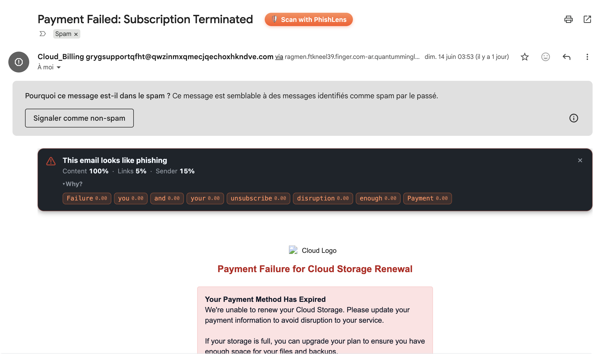
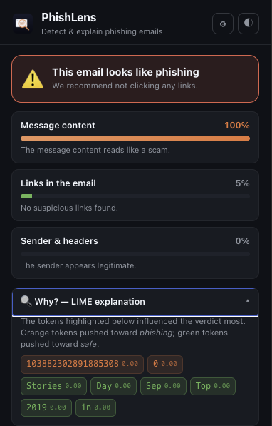
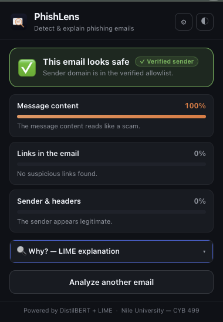
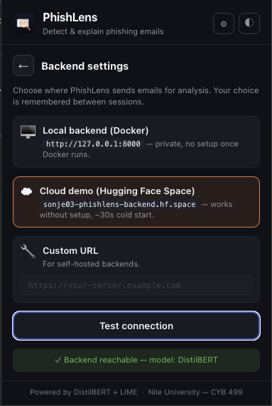

<div align="center">


# PhishLens

**Detect and explain phishing emails — in real time, inside your browser.**

A fine-tuned DistilBERT classifier, two heuristic agents (URLs, headers),
weighted fusion with a trusted-domain allowlist, and a LIME explanation panel,
wrapped in a Chrome extension that injects directly into Gmail.

[](https://www.python.org/)
[](https://fastapi.tiangolo.com/)
[](https://pytorch.org/)
[](https://developer.chrome.com/docs/extensions/mv3/intro/)
[](LICENSE)
[](https://huggingface.co/spaces/Sonje03/phishlens-backend)
[](https://huggingface.co/Sonje03/phishlens-distilbert)

<br/>



</div>

---

## ✨ What it does

PhishLens injects a **🛡 Scan with PhishLens** button next to the subject of
every open Gmail message. One click runs the three agents and drops a verdict
banner directly into the Gmail UI — Safe or Phishing, with per-agent scores
and a collapsible LIME explanation. You can also open the extension popup to
analyse an arbitrary `.eml` file or raw pasted text.

The text agent is a **DistilBERT fine-tuned on ~30k emails** drawn from
multiple public phishing corpora. On the held-out test split it reaches
**F1 ≈ 0.97** with a ~3% false-positive rate — and the LIME explanation
tells you which tokens pushed the verdict that way.

<table align="center">
  <tr>
    <td align="center">
      <br/>
      <sub><em>Phishing verdict — 3 agents + LIME tokens.</em></sub>
    </td>
    <td align="center">
      <br/>
      <sub><em>Safe verdict — verified-sender badge for allowlisted domains.</em></sub>
    </td>
  </tr>
</table>

---

## 🏗 Architecture

```
┌─────────────────────────────────────┐        ┌──────────────────────────────────┐
│        Chrome extension (MV3)       │        │     FastAPI backend (Docker)     │
│                                     │        │                                  │
│  ┌──────────┐    ┌───────────────┐  │ POST   │  ┌────────────────────────────┐  │
│  │  Popup   │    │ Gmail content │  │ /analyse  │   DistilBERT  text-agent   │  │
│  │  (HTML/  │    │   script      │──┼────────┼─▶│   Heuristic   url-agent    │  │
│  │  CSS/JS) │    │ (MutationObs) │  │ /explain  │   Heuristic   metadata     │  │
│  └──────────┘    └───────────────┘  │        │  │   Weighted fusion + LIME   │  │
│         ▲                ▲          │        │  └────────────────────────────┘  │
│         │                │          │        │            │                     │
│         └──── Background service ───┘        └────────────┼─────────────────────┘
│              (CSP-bypass proxy)                           ▼
│                                                  ./model/  (DistilBERT)
└─────────────────────────────────────┘
```

The trained URL and metadata Random Forest agents live in a sibling repo
([dodi-ctrl/PhishingDetector](https://github.com/dodi-ctrl/PhishingDetector)).
The runtime image here ships with heuristic fallbacks so you can demo the
full pipeline without depending on `.pkl` artefacts.

---

## 🚀 Quickstart

You have three options. The extension's gear (⚙) menu lets you switch
between them at any time without reloading.

<div align="center">
  
</div>

### Option 0 · Cloud demo (zero setup)

Just install the extension, switch the backend to **Cloud demo** in the
gear menu, and you're done. The popup calls
[`https://sonje03-phishlens-backend.hf.space`](https://huggingface.co/spaces/Sonje03/phishlens-backend)
— a Hugging Face Space running the same FastAPI image as Option 1.

Free-tier caveats: ~30–60 s cold start after inactivity, CPU-only inference,
public endpoint (don't paste sensitive email content).

### Option 1 · Docker (recommended for daily use)

```bash
# 1. Get the model files into ./backend/model/ (one-time)
mkdir -p backend/model
huggingface-cli download Sonje03/phishlens-distilbert --local-dir backend/model

# 2. Bring the backend up
cd backend
docker compose up --build
```

After ~30 seconds you should see `Model loaded on device=cpu. Ready on http://0.0.0.0:8000`.

### Option 2 · Manual Python install (without Docker)

```bash
cd backend
python3 -m venv venv
source venv/bin/activate            # Windows: venv\Scripts\activate
pip install -r requirements.txt
uvicorn extension_backend:app --host 127.0.0.1 --port 8000
```

The first call will warm DistilBERT (~3 s on Apple Silicon via MPS, ~6 s on CPU).

### Load the Chrome extension

1. Open `chrome://extensions`
2. Toggle **Developer mode** (top-right)
3. Click **Load unpacked**
4. Select the `extension/` folder
5. The PhishLens icon appears in your toolbar.

---

## 🎯 Usage

### Popup mode

Click the PhishLens icon. Two tabs:

- **📂 File** — drop or browse a `.eml` file (e.g. from Gmail's "Download message")
- **📝 Paste** — paste raw email body text, with optional clipboard button

Both produce a verdict + 3-agent breakdown + collapsible LIME explanation.

### Gmail auto-scan

When you visit `https://mail.google.com` and open any email, a small orange
**🛡 Scan with PhishLens** pill appears next to the subject line. Clicking it
runs the same pipeline and injects a verdict banner above the email body —
without leaving Gmail.

### Theme

The popup has a ◐ toggle (dark/light). Your choice is broadcast through
`chrome.storage.local`, so the Gmail-injected banner uses the same theme.
Default is to follow your OS dark-mode preference.

---

## ⚙️ Configuration

### Environment variables

| Variable | Default | Purpose |
|---|---|---|
| `MODEL_DIR` | `./model` | Path to the unzipped DistilBERT checkpoint |

### Trusted sender allowlist

`extension_backend.py` ships with a curated allowlist of well-known
institutional senders. Edit the `TRUSTED_DOMAINS` set to add or remove entries.

A request whose sender domain matches the allowlist gets:
- the metadata-agent score floored at 0.05
- the text-agent weight halved in the fusion
- the high-confidence single-agent override disabled
- the phishing threshold raised to 0.65

This is what stops DistilBERT from false-positiving on real hospital
lab-report or bank-KYC emails that share template wording with phishing.

### Fusion weights

| Knob | Default |
|---|---|
| `W_TEXT` | `0.34` |
| `W_URL` | `0.33` |
| `W_META` | `0.33` |
| `FUSION_THRESHOLD` | `0.5` |
| `HIGH_CONF_OVERRIDE` | `0.85` |

---

## 📁 Project layout

```
PhishLens/
├── backend/
│   ├── extension_backend.py      # FastAPI app (/analyse, /explain)
│   ├── Dockerfile
│   ├── docker-compose.yml
│   ├── requirements.txt
│   └── model/                    # DistilBERT — NOT tracked by git
├── extension/
│   ├── manifest.json             # MV3 manifest
│   ├── background.js             # service worker (CSP-bypass fetch proxy)
│   ├── popup/                    # popup UI (HTML/CSS/JS, no build step)
│   ├── content_scripts/          # Gmail injection
│   └── icons/                    # PNG + SVG
├── docs/                         # screenshots, UML diagrams
└── README.md
```

---

## 🧰 Tech stack

- **Backend:** FastAPI · PyTorch · Hugging Face Transformers · LIME · NumPy
- **Model:** DistilBERT fine-tuned on a multi-source phishing email corpus
- **Extension:** Vanilla HTML/CSS/JS · Chrome MV3 · no build step
- **Inference acceleration:** Apple Silicon MPS · CUDA · CPU fallback

---

## 🎓 Academic context

Final-year project for the **B.Sc. Cybersecurity** programme,
[Nile University of Nigeria](https://nileuniversity.edu.ng/),
Department of Cybersecurity, session 2025–2026.

---

## 🗺 Roadmap

- [ ] Integrate Google Safe Browsing API v4 for the URL agent
- [ ] Replace heuristic metadata agent with the trained Random Forest
- [ ] Yahoo Mail content script
- [ ] Outlook Web content script
- [ ] Local analysis history (chrome.storage) with export
- [ ] Multi-architecture Docker images (linux/amd64 + linux/arm64)

---

## 📄 License

Released under the [MIT License](LICENSE).

---

## 🔗 Related repository

The model-training notebooks and the URL / metadata Random Forest agents
live at [**PhishingDetector**](https://github.com/dodi-ctrl/PhishingDetector).
